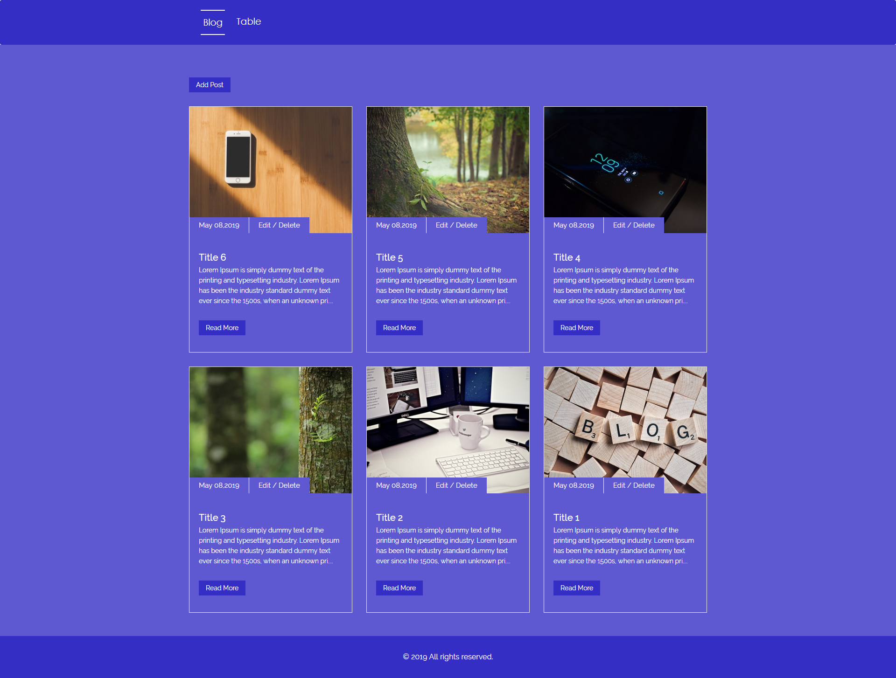
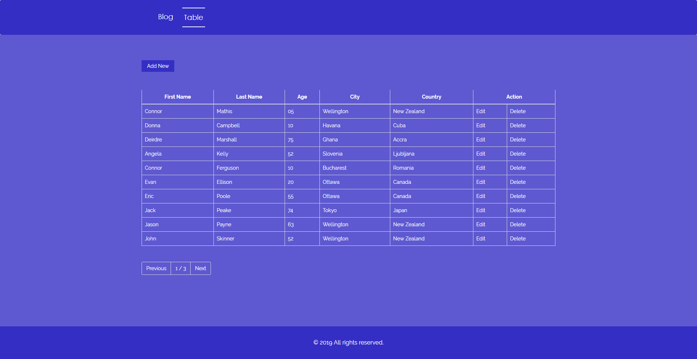

# Laravel and Vuejs with CRUD operation





```
1)Run command on terminal git clone https://github.com/vermaboys/vuejs-laravel-crud.git
2)cp .env.example .env
3)php artisan key:generate
4)Define Database name,user name,password in .env file
DB_DATABASE=*******
DB_USERNAME=*******
DB_PASSWORD=*******
5)php artisan make:auth
6)php artisan migrate
7)php artisan db:seed
8)Run command on terminal composer install
9)Run command on terminal npm install
10)Run command on terminal npm run watch
```

